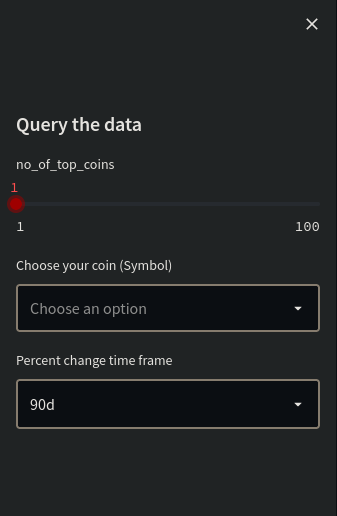
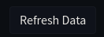

# Table of contents 
- [Installation](#installation)
- [Using your api key](#using-your-api-key)
- [Sidebar](#sidebar)
- [Functions](#functions)

# Installation
*Clone the repo*
```
git clone https://github.com/Shayan-Raza/Cryptocurrency-data-web-app.git
```
*Change to the cloned directory*
```
cd Cryptocurrency-data-web-app 
```
*Run the app with streamlit*
```
streamlit run webapp.py
```
**In your browser enter the address**

> http://localhost:8501/

# Using your api key
*Create a file api_key.py*
```
touch api_key.py
```
*Open the file in a text editor*
```
nano api_key.py
```

*Create a variable api with your api key*
```
api="" #key in ""
```
> Use this step to get the latest data. Else I have provided a premade file with dated data.
## Sidebar


# Functions
Functions that are available in the webapp

### Refresh data

<br>
Upon clicking runs the script **data.py** which saves an output in **Data.csv** streamlit then reads the updated data

[Setup API Key first](#using-your-api-key)

### Download CSV

<br>
Downloads the csv with the dataset preview. Downloads only for the coins selected in the [sidebar](#sidebar)
